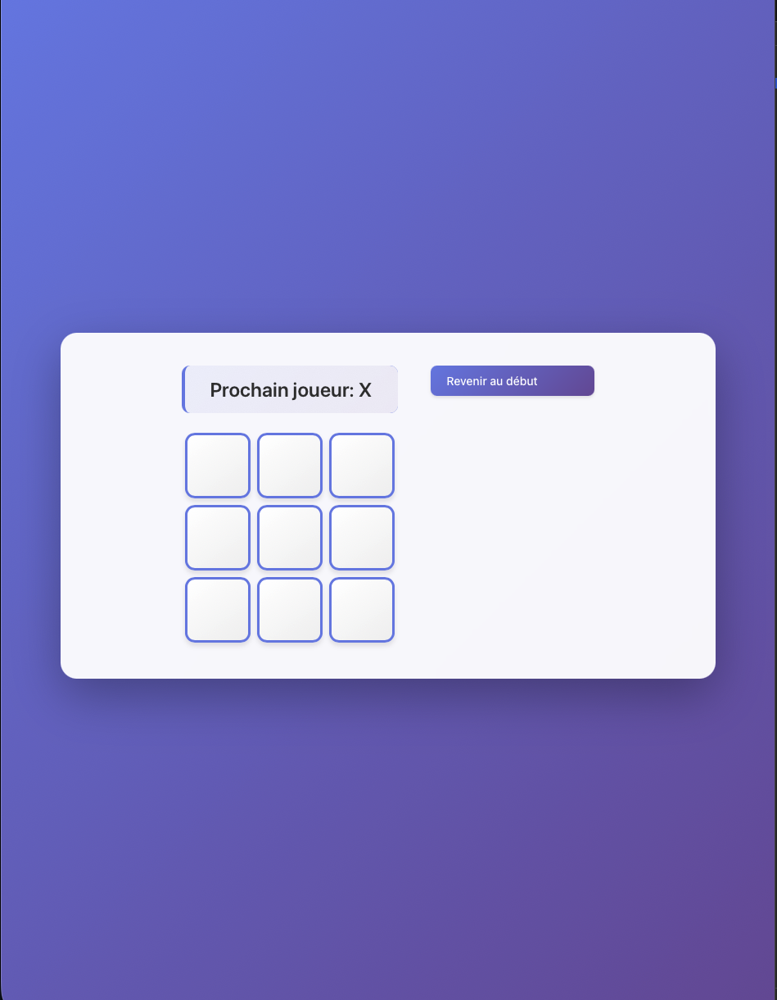

# Modern React Tic Tac Toe

An updated and visually enhanced version of the classic Tic Tac Toe game, built with React. Features responsive design, sleek modern CSS, and an interactive user experience.


## ✨ Features

- Interactive 3x3 Tic Tac Toe board
- Move history with time travel (undo and replay moves)
- Animated and modernized UI using advanced CSS
- Responsive design for all devices
- Clean React component structure


## 🚀 Getting Started

1. **Clone the repository:**
git clone https://github.com/YOUR-USERNAME/tic-tac-toe-modern-react.git
cd tic-tac-toe-modern-react

2. **Install dependencies:**

```bash
  npm install
```

3. **Run the app:**

```bash
  npm start
```

4. Visit [http://localhost:3000](http://localhost:3000) in your browser.

## 🎨 Preview



## 🛠️ Built With

- React
- Modern CSS (with animations and gradients)
- JavaScript (ES6+)

## 📚 About the Project

This project started as the official React tutorial, but with a fully re-imagined CSS for a more engaging and modern look. It's a great example for beginners to learn about state, props, and functional UI design principles in React.

## 🤝 Contributing

Contributions are welcome! Feel free to open an issue, suggest enhancements, or submit pull requests to help improve this project.

## 📝 License

This project is licensed under the MIT License. See the [LICENSE](LICENSE) file for details.

## 🔗 References

- [Official React Tic Tac Toe Tutorial](https://react.dev/learn/tutorial-tic-tac-toe)
- [Modern CSS inspiration]
